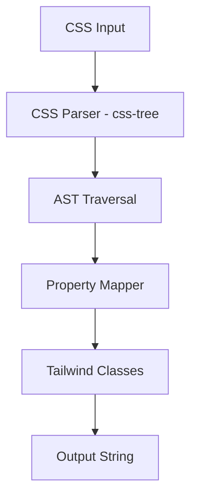

# Tailwindify - Implementation Plan

## High-Level Architecture



### Architecture Overview

1. **UI Layer** - Next.js App Router with Monaco Editor for code editing
2. **Conversion Engine** - Modular conversion logic with CSS AST parsing
3. **Mapping Layer** - CSS property to Tailwind utility class mappings

---

## Project Structure

```
tailwindify/
├── src/
│   ├── app/
│   │   ├── layout.tsx          # Root layout with metadata
│   │   ├── page.tsx            # Main converter page
│   │   └── globals.css         # Global styles
│   ├── components/
│   │   ├── CodeEditor.tsx      # Monaco editor wrapper
│   │   └── ConverterLayout.tsx # Side-by-side layout
│   ├── lib/
│   │   ├── converter/
│   │   │   ├── index.ts        # Main conversion function
│   │   │   ├── parser.ts       # CSS parsing utilities
│   │   │   ├── mappings.ts     # CSS → Tailwind mappings
│   │   │   └── spacing.ts      # px → Tailwind spacing scale
│   │   └── utils.ts            # Helper utilities
│   └── types/
│       └── index.ts            # TypeScript type definitions
├── tailwind.config.ts
├── package.json
└── tsconfig.json
```

---

## Key Dependencies

| Package | Purpose |
|---------|---------|
| `@monaco-editor/react` | Code editor component |
| `css-tree` | CSS AST parsing |

---

## Supported CSS Mappings (MVP)

| CSS Property | Example Value | Tailwind Class |
|--------------|---------------|----------------|
| `display` | `flex`, `grid`, `block` | `flex`, `grid`, `block` |
| `flex-direction` | `column` | `flex-col` |
| `justify-content` | `center` | `justify-center` |
| `align-items` | `center` | `items-center` |
| `text-align` | `center` | `text-center` |
| `font-weight` | `bold` | `font-bold` |
| `margin` | `16px` | `m-4` |
| `padding` | `8px` | `p-2` |
| `width` | `100%` | `w-full` |
| `height` | `auto` | `h-auto` |
| `font-size` | `14px` | `text-sm` |
| `color` | `#fff` | `text-[#fff]` |
| `background-color` | `#000` | `bg-[#000]` |
| `border-radius` | `8px` | `rounded-lg` |

---

## Verification Plan

1. Start dev server: `pnpm dev`
2. Test with sample CSS input
3. Verify Copy button functionality
4. Check responsive layout

---

## Future TODOs

- [ ] Responsive variants (sm:, md:, lg:)
- [ ] Shorthand properties (margin: 8px 16px)
- [ ] CSS variables support
- [ ] Dark mode toggle
- [ ] VSCode extension export
